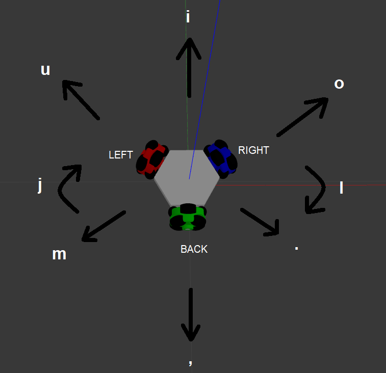

# teleop_twist_keyboard_omni3
Generic Keyboard Teleop for 3 Wheeled Omnidirectional robots

# Installation
1. `cd ~/catkin_ws/src`
2. `git clone https://github.com/YugAjmera/teleop_twist_keyboard_omni3`
3. `cd ~/catkin_ws`
4. `catkin_make`
5. `source ~/catkin_ws/devel/setup.bash`
6. `source ~/.bashrc`

# Launch
Run.
```
rosrun teleop_keyboard_omni3 teleop_keyboard_omni3.py 
```

# Usage


```
Reading from the keyboard !
---------------------------
Moving around:
   u    i    o
   j    k    l
   m    ,    .

For Holonomic mode (strafing), hold down the shift key:
---------------------------
   U    I    O
   J    K    L
   M    <    >


anything else : stop

q/z : increase/decrease max speeds by 10%

CTRL-C to quit
```

